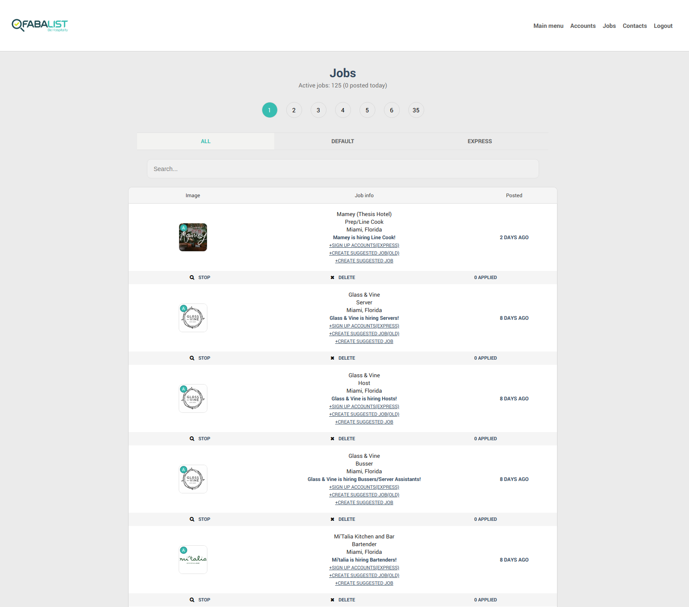

<!-- INTRO -->
 

  <a href="img/1.jpg?raw=true">
    

      
    

  </a>

  <h3 align="center">Fabalist - service for food and beverage industry</h3>

  

    Project includes web-application + Android/Ios apps. During last 6 years over 50000 resumes were sent using our services and about 20% of people got hired.
    I have successfully developed and maintained website + backend API for mobile apps. In this project I have worked together with project managers, Android/Ios developers and designers. 
    Website: <a href="https://fabalist.com">Open</a>.
  

<!-- PROJECT SHORT OVERVIEW -->
### Stack

* Symfony 4
* Doctrine
* Mysql
* Memcached
* Sphinx
* Sass
* Jenkins/Docker/Deployer
* React
* 3-rd party integrations: Stripe, Mailgun, Google/Linkedin login

### Main functionality in business accounts (for employers)

* Post job or multiple jobs
* Stripe subscriptions or one-time payments for job postings
* Add job seekers to contacts or save to candidates list
* Search resumes and filter by positions
* Start a chat with any applicant, call or invite to interview
* Organize hired staff into teams
* Create/upload work schedules for teams 
* Create newsfeed or chat for each team
* Create/manage + switch between multiple accounts for each user 

### Main functionality in personal accounts (for job seekers)

* Browse jobs on list or map
* Upload file with a resume or create with resume builder
* Apply on jobs
* Receive job alerts by selected preferences
* Save jobs to favorites
* View job or restaurant profile
* View near by restaurants in restaurant profile
* Join to restaurant team by invite
* View team newsfeed and schedules

<!-- WEBSITE OVERVIEW -->
## Website Overview

  <h3 align="center">Landing page</h3>

<a href="img/2.png?raw=true">
  

    
  

</a>

  <h3 align="center">Mobile layout for landing page</h3>

<a href="img/3.png?raw=true">
  

    
  

</a>

  <h3 align="center">Restaurants page</h3>
  
 Entries are sorted by total number of applicants(on all jobs). The total number of applicants for each restaurant is recalculated in separate bg job(launched from cron job).

<a href="img/4.png?raw=true">
  

    
  

</a>

    <h3 align="center">Restaurant profile page</h3>
    
Contains restaurant info/photos, list of job postings / list of team members(by categories). Near by list is created with geo search query: nearby restaurants are selected(by given point lat/lng + haversine formula for two points on sphere) + sorted by distance.

<a href="img/5.jpg?raw=true">
  

    
  

</a>

    <h3 align="center">Mobile layout for restaurant profile page</h3>

<a href="img/6.png?raw=true">
  

    
  

</a>

    <h3 align="center">Near by page</h3>

<a href="img/7.png?raw=true">
  

    
  

</a>

    <h3 align="center">Jobs page</h3>
    
Contains a list of jobs / map with jobs. Job postings are selected using selected filters list(By position/restaurant type/employment type). Besides that 1 of 3 select types are used: by geolocation(by def.), by zip code or by city. Select by geolocation query uses lat/lng received from client and transforms it to zip codes near by that point(which are used in query to select jobs).

<a href="img/8.png?raw=true">
  

    
  

</a>

    <h3 align="center">View job posting page</h3>
    
Job seeker can apply with 1 click(if is logged in) or fill up short
    sign up + apply form.

<a href="img/9.png?raw=true">
  

    
  

</a>

    <h3 align="center">Sign up + apply form (for personal accounts)</h3>
    
Alternative to default sign up form(which consists from ~15 fields and requires 2 steps to complete). Contains only the most basic fields which are required to apply on job.

<a href="img/10.png?raw=true">
  

    
  

</a>

    <h3 align="center">Sign up + post job form (for business accounts)</h3>
    
Alternative to default sign up form(which consists from ~30 fields and requires 2 steps to complete + extra step to create job posting). Contains only the most basic fields which are required to create job posting.

<a href="img/13.png?raw=true">
  

    
  

</a>

    <h3 align="center">Log in form</h3>

<a href="img/11.png?raw=true">
  

    
  

</a>

    <h3 align="center">Sign up form</h3>

<a href="img/12.png?raw=true">
  

    
  

</a>

    <h3 align="center">Dashboard for job seeker (personal account)</h3>
    
Job seeker can upload or create resume, view favorited jobs or explore latest job alerts. Job positions in which employee is interested can be configured on 'Setup Alerts' page.

<a href="img/14.png?raw=true">
  

    
  

</a>

    <h3 align="center">Dashboard for restaurant manager (business account)</h3>
    
Manager can manage job postings(create,stop or repost), manage saved candidates and explore applicant resumes. Manager can contact any applicant through our service, email or direct phone call.(Employee phone is shown only if he applied on at least one restaurant job)

<a href="img/15.png?raw=true">
  

    
  

</a>

    <h3 align="center">Resumes page</h3>
    
Manager can filter applicants by job position or search by first/last name.

<a href="img/16.png?raw=true">
  

    
  

</a>

    <h3 align="center">Post job page</h3>
    
Manager can create unlimited job postings if stripe subscription plan is active. Otherwise 'Purchase 1 job posting' popup will appear on 'POST' button click.

<a href="img/17.png?raw=true">
  

    
  

</a>

    <h3 align="center">View resume page</h3>

<a href="img/18.png?raw=true">
  

    
  

</a>

    <h3 align="center">Chats page</h3>
    
Project supports chats with arbirtrary number of participants as well as conversations(one-to-one chats).

<a href="img/19.jpg?raw=true">
  

    
  

</a>

    <h3 align="center">Notifications page</h3>
    
Almost any significant action in project creates notification. For example, when job seeker has sent resume on job - restaurant receives corresponding notification(email or push). After that, when manager has opened applicant view resume page - job seeker receives "Your resume was viewed by ..." notification.

<a href="img/20.png?raw=true">
  

    
  

</a>

    <h3 align="center">Resume builder</h3>

<a href="img/21.jpg?raw=true">
  

    
  

</a>

    <h3 align="center">View resume created in resume builder</h3>

<a href="img/22.jpg?raw=true">
  

    
  

</a>

    <h3 align="center">Admin dashboard</h3>

<a href="img/23.png?raw=true">
  

    
  

</a>

    <h3 align="center">Admin dashboard - jobs page</h3>

<a href="img/24.png?raw=true">
  

    
  

</a>

    <h3 align="center">Mobile applications work through REST API</h3>

<a href="img/26.jpg?raw=true">
  

    
  

</a>

(<a href="#top">back to top</a>)
